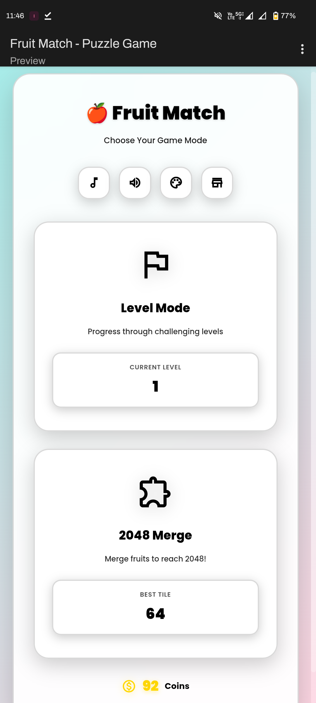
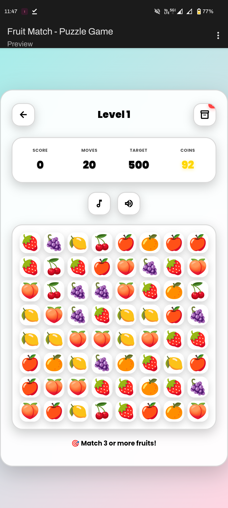
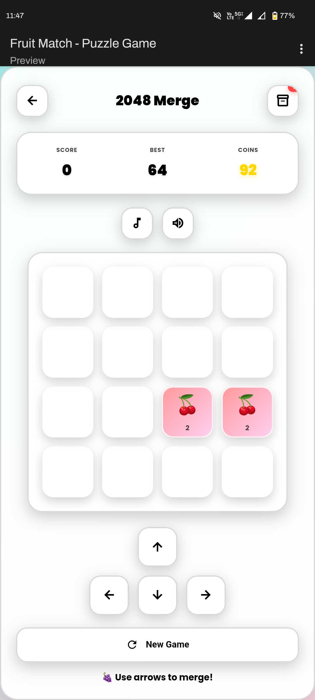
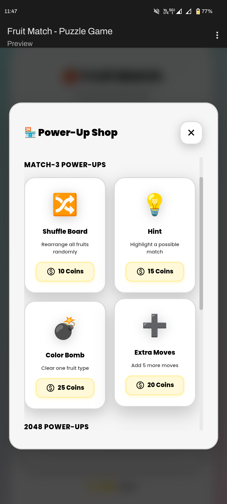

# FruitPuzzle
A beautiful Match-3 and 2048 merge puzzle game with 36 themes, inventory system, power-ups, custom audio support, and PWA capabilities. Built with pure HTML/CSS/JS.

# 🍎 Fruit Puzzle - Modern Match-3 & 2048 Game

### 🎮 A stunning Match-3 and 2048 merge puzzle game with glassmorphism UI, 36 themes, and PWA support!

 

  

---

## 📸 Game Preview

<table>
  <tr>
    <td align="center" width="50%">
      
       
      <b>🏠 Main Menu</b>
       
      Choose your game mode & customize themes
    </td>
    <td align="center" width="50%">
      
       
      <b>🎯 Match-3 Mode</b>
       
      Strategic fruit matching with smooth animations
    </td>
  </tr>
  <tr>
    <td align="center" width="50%">
      
       
      <b>🧩 2048 Merge Mode</b>
       
      Merge fruits to reach the ultimate 2048 tile
    </td>
    <td align="center" width="50%">
      
       
      <b>🏪 Power-Up Shop</b>
       
      Buy and collect strategic power-ups
    </td>
  </tr>
</table>

---

## ✨ Key Features

| 🎮 Gameplay | 🎨 Design | 💎 Power-Ups | 📱 PWA |
|:----------:|:---------:|:------------:|:------:|
| 2 Game Modes | 36 Themes | 8 Power-Ups | Offline Play |
| 10+ Levels | Glassmorphism | Inventory System | Installable |
| Auto-Save | Responsive | Coin System | Fast Loading |
| Smooth Animations | No Scroll UI | Strategic Use | Push Ready |

### 🎯 Game Modes

<b>🍓 Match-3 Level Mode</b>

 

- 🏆 Progress through **10+ challenging levels**
- 🎯 Match 3 or more fruits to score points
- 💰 Earn coins for every successful match
- ⚡ Auto-fill system (no blank spaces!)
- 🎨 Smooth GSAP animations
- 🔄 Increasing difficulty

<b>🧩 2048 Merge Mode</b>

 

- 🔢 Merge identical fruits to create higher values
- 🎯 Reach the ultimate **2048 tile**
- ↩️ Undo system for strategic gameplay
- ⚡ Special 2048-exclusive power-ups
- ⌨️ Keyboard + touch controls
- 🏆 Track your best tile

---

## 🎨 Stunning Themes

Choose from **36 beautiful themes** including:

- 🌟 **35 Gradient Themes**: Purple Dream, Pink Sunset, Ocean Blue, Fresh Mint, and more!
- 🌑 **AMOLED Dark**: Battery-friendly dark mode with white UI

All themes feature:
✅ Perfect visibility | ✅ Smooth transitions | ✅ Consistent design

---

## 💎 Power-Ups & Inventory System

### 🎒 Collect, Store, and Use Strategically!

<b>🍎 Match-3 Power-Ups</b>

| Icon | Power-Up | Description | Cost |
|:----:|:---------|:------------|:----:|
| 🔀 | **Shuffle Board** | Rearrange all fruits randomly | 💰 10 |
| 💡 | **Hint** | Highlights possible matches with glow | 💰 15 |
| 💣 | **Color Bomb** | Clear all fruits of one type | 💰 25 |
| ➕ | **Extra Moves** | Add 5 more moves to level | 💰 20 |

<b>🧩 2048 Power-Ups</b>

| Icon | Power-Up | Description | Cost |
|:----:|:---------|:------------|:----:|
| ↩️ | **Undo Move** | Reverse your last move | 💰 15 |
| 🗑️ | **Remove Tile** | Remove the lowest value tile | 💰 20 |
| ⚡ | **Auto Merge** | Automatically merge two tiles | 💰 30 |
| 🧹 | **Clear Small** | Remove all tiles under 8 | 💰 25 |

> **💡 Pro Tip**: Power-ups go to your inventory! Use them strategically for maximum impact!

---

## 🛠️ Tech Stack

HTML5 -  CSS3 -  Vanilla JavaScript (ES6+) -  GSAP -  Canvas Confetti
Service Worker -  LocalStorage -  Progressive Web App

| Technology | Purpose |
|:-----------|:--------|
| **HTML5** | Semantic structure & game board |
| **CSS3** | Glassmorphism effects & 36 themes |
| **JavaScript** | Game logic & interactions |
| **GSAP** | Smooth animations |
| **Canvas Confetti** | Celebration effects |
| **Service Worker** | PWA & offline capabilities |
| **LocalStorage** | Game progress persistence |

---

---

## 🚀 Quick Start

### 🎮 Play Online

**[Click here to play now!](https://darkdetox.github.io/fruitpuzzle/)**

### 💻 Run Locally

**1️⃣ Clone the repository**
git clone https://github.com/DarkDetox/fruitpuzzle.git

**2️⃣ Navigate to project folder**
cd fruitpuzzle

**3️⃣ Open in browser (no build required!)**
open index.html

**Or use a local server (recommended)**
python -m http.server 8000

Then visit: **http://localhost:8000**

> **💡 Pro Tip**: Using a local server prevents CORS issues with Service Worker!

---

### 📱 Install as PWA

<table>
<tr>
<td>
<h4>Step 1</h4>
Visit <a href="https://darkdetox.github.io/fruitpuzzle/">https://darkdetox.github.io/fruitpuzzle/</a>
</td>
</tr>
<tr>
<td>
<h4>Step 2</h4>
Click the <b>"Install"</b> button in your browser
</td>
</tr>
<tr>
<td>
<h4>Step 3</h4>
Enjoy offline gameplay! 🎮
</td>
</tr>
</table>

**Supported Platforms:**
- 🖥️ **Desktop**: Chrome, Edge, Firefox, Safari
- 📱 **Mobile**: Android, iOS

---

## 🎵 Custom Assets (Optional)

Want to personalize the game? Add your own sounds!

1. Create an `assets/` folder
2. Add audio files:
   - `background-music.mp3` - Background music
   - `match.mp3` - Match sound effect
   - `click.mp3` - Button click sound
   - `win.mp3` - Level complete sound
   - `lose.mp3` - Game over sound

**If custom assets aren't found, the game uses Web Audio API fallback automatically!** 🎶

---

## 🌐 Browser Support

| Browser | Version | PWA Install | Status |
|:-------:|:-------:|:-----------:|:------:|
| Chrome | 90+ | ✅ | ✅ Fully Tested |
| Edge | 90+ | ✅ | ✅ Fully Tested |
| Firefox | 88+ | ✅ | ✅ Supported |
| Safari | 14+ | ✅ | ✅ Supported |
| Mobile | Latest | ✅ | ✅ Optimized |

---

## 🎯 Roadmap

**Coming Soon™**

- [ ] 🎮 Multiplayer mode
- [ ] 📅 Daily challenges
- [ ] 🏆 Global leaderboards
- [ ] 🍉 More fruit types
- [ ] 🏅 Achievement system
- [ ] 📱 Social sharing
- [ ] 🌈 More themes (50+ goal!)
- [ ] 🎨 Custom fruit skins

---

## 🤝 Contributing

Contributions are **welcome**! Feel free to:

1. 🍴 Fork the project
2. 🌿 Create your feature branch (`git checkout -b feature/AmazingFeature`)
3. 💾 Commit your changes (`git commit -m 'Add AmazingFeature'`)
4. 📤 Push to the branch (`git push origin feature/AmazingFeature`)
5. 🎉 Open a Pull Request

---

## 📄 License

This project is licensed under the **MIT License** - see the [LICENSE](LICENSE) file for details.

Copyright (c) 2025 DarkDetox

---

## 👨‍💻 Author

**DarkDetox**

---

## ⭐ Show Your Support

**If you like this project, give it a ⭐ on GitHub!**

---

## 🙏 Acknowledgments

- 🎨 System emoji graphics
- ✨ GSAP for smooth animations
- 🎊 Canvas Confetti for celebrations
- 🔤 Google Fonts (Poppins)
- 🎯 Material Icons
- 💜 Open source community

---

### 🍎 Made with ❤️ and 🍓 by DarkDetox

**[🎮 Play Now](https://darkdetox.github.io/fruitpuzzle/)** | **[⭐ Star This Repo](https://github.com/DarkDetox/fruitpuzzle)** | **[🐛 Report Bug](https://github.com/DarkDetox/fruitpuzzle/issues)** | **[💡 Request Feature](https://github.com/DarkDetox/fruitpuzzle/issues)**

---

**[⬆ Back to Top](#-fruit-puzzle---modern-match-3--2048-game)**

